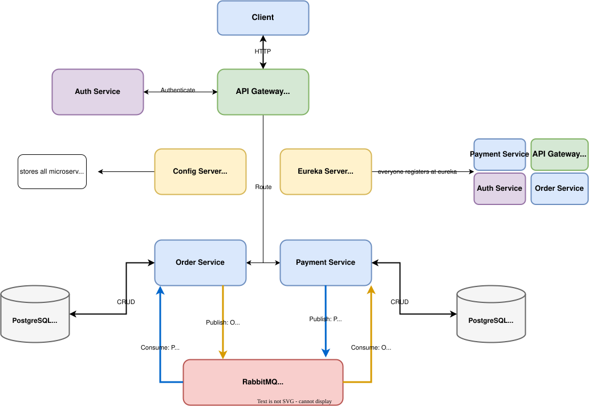

# Delivery System - Event-Driven Microservices

Sistema de delivery construído com arquitetura de microserviços orientada a eventos, utilizando RabbitMQ para comunicação assíncrona entre serviços.

## Sobre o Projeto

Este projeto foi desenvolvido para praticar conceitos avançados de arquitetura de software, implementando um sistema de delivery simples com microserviços independentes que se comunicam através de eventos. A arquitetura permite alta escalabilidade, resiliência e baixo acoplamento entre os serviços.

## Arquitetura

O sistema é composto por múltiplos microserviços, cada um com sua responsabilidade específica:



### Componentes

- **API Gateway:** Ponto de entrada único, roteamento de requisições e balanceamento de carga
- **Order Service:** Gerenciamento de pedidos e orquestração do fluxo de entrega
- **Payment Service:** Processamento de pagamentos e validações financeiras
- **Auth Service:** Autenticação e autorização de usuários
- **Config Server:** Gerenciamento centralizado de configurações
- **Eureka Server:** Service discovery para registro e descoberta de microserviços
- **RabbitMQ:** Message broker para comunicação assíncrona entre serviços

## Tecnologias Utilizadas

- **Java** - Linguagem principal
- **Spring Boot** - Framework base dos microserviços
- **Spring Cloud** - Ferramentas para arquitetura distribuída
    - Spring Cloud Gateway
    - Spring Cloud Config
    - Spring Cloud Netflix Eureka
- **RabbitMQ** - Message broker para arquitetura event-driven
- **Docker** - Containerização dos serviços
- **Makefile** - Automação de comandos

## Conceitos Aplicados

### Event-Driven Architecture (EDA)

A arquitetura orientada a eventos permite que os microserviços se comuniquem de forma assíncrona, publicando e consumindo eventos através do RabbitMQ. Isso proporciona:

- **Desacoplamento:** Serviços não precisam conhecer uns aos outros diretamente
- **Escalabilidade:** Cada serviço pode escalar independentemente
- **Resiliência:** Falhas em um serviço não afetam diretamente outros
- **Flexibilidade:** Novos serviços podem ser adicionados facilmente

### Service Discovery

Utilização do Eureka Server para registro dinâmico e descoberta de serviços, permitindo que os microserviços se encontrem automaticamente sem configuração manual de endpoints.

### API Gateway Pattern

Implementação de um gateway único que:
- Centraliza o roteamento de requisições
- Aplica políticas de segurança
- Implementa rate limiting
- Realiza load balancing

## Pré-requisitos

- Docker e Docker Compose instalados
- Java 21 instalado
- Maven instalado

## Como Executar

### **Opção 1: Docker Compose (Recomendado)**

```bash
# Clone o repositório
git clone https://github.com/pedrodese/Delivery-System-Event-Driven-Microservices.git
cd Delivery-System-Event-Driven-Microservices

# Buildar as imagens
docker compose build

# Executar todos os serviços - Com logs
docker compose up

# Ou executar em background
docker compose up -d
```

### **Opção 2: Usando Makefile**

```bash
# Executar com Make
make run

# Parar os serviços
make stop

# Ver logs
make logs
```

### **Opção 3: Desenvolvimento Local**

```bash
# Iniciar apenas o RabbitMQ e dependências
docker-compose up -d rabbitmq postgres

# Executar cada microserviço manualmente
cd config-server && ./mvnw spring-boot:run
cd eureka-server && ./mvnw spring-boot:run
cd auth-service && ./mvnw spring-boot:run
cd order-service && ./mvnw spring-boot:run
cd payment-service && ./mvnw spring-boot:run
cd api-gateway && ./mvnw spring-boot:run
```

## Endpoints da API

- **API Gateway:** http://localhost:8080
- **Eureka Dashboard:** http://localhost:8761
- **Config Server:** http://localhost:8888
- **RabbitMQ Management:** http://localhost:15672 (guest/guest)

## Fluxo de Eventos

1. Cliente faz um pedido através do API Gateway
2. Order Service recebe a requisição e persiste o pedido
3. Order Service publica evento `OrderCreated` no RabbitMQ
4. Payment Service consome o evento e processa o pagamento
5. Payment Service publica evento `PaymentProcessed`
6. Order Service consome e atualiza o status do pedido
7. Cliente recebe confirmação

## Comandos Úteis

```bash
# Executar todos os serviços
docker-compose up -d

# Parar os containers
docker-compose down

# Parar e remover volumes (cuidado: apaga os dados)
docker-compose down -v

# Ver logs de um serviço específico
docker-compose logs -f order-service
docker-compose logs -f payment-service

# Rebuild de um serviço específico
docker-compose up -d --build order-service

# Acessar o RabbitMQ Management
# URL: http://localhost:15672
# User: guest / Password: guest

# Ver status dos serviços
docker-compose ps
```

## Próximos Passos

- [ ] Implementar saga pattern para transações distribuídas
- [ ] Adicionar observabilidade com Spring Cloud Sleuth e Zipkin
- [ ] Implementar circuit breaker com Resilience4j
- [ ] Implementar delivery service
- [ ] Adicionar métricas com Prometheus e Grafana
